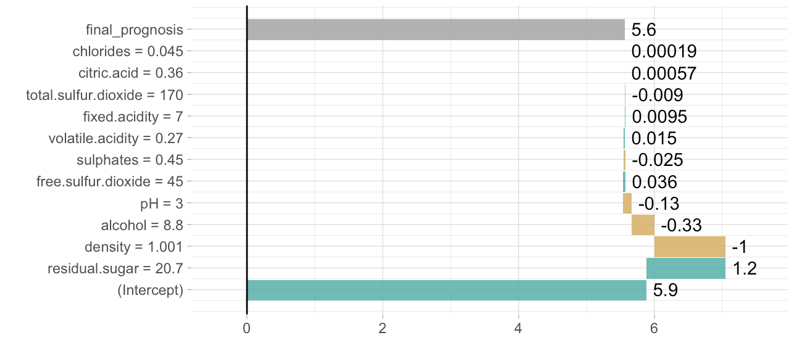

[](https://cran.r-project.org/package=breakDown)
[](https://github.com/pbiecek/breakDown/pulls)
[](https://github.com/pbiecek/breakDown/issues)

# breakDown

Modified Waterfall plots for glm, lm and randomForest

## Install from GitHub

```
devtools::install_github("pbiecek/breakDown")
```

## Cheatsheets


## Example for lm model

Get data with [archivist](https://github.com/pbiecek/archivist)

* broken object: `archivist::aread("pbiecek/breakDown/arepo/81c5be568d4db2ec795dedcb5d7d6599")`
* the plot: `archivist::aread("pbiecek/breakDown/arepo/7b40949a0fdf9c22780454581d4b556e")`

The R code

```{r}
library(breakDown)
url <- 'https://archive.ics.uci.edu/ml/machine-learning-databases/wine-quality/winequality-white.csv'
wine <- read.table(url, header = T, sep=";")
head(wine, 3)
##   fixed.acidity volatile.acidity citric.acid residual.sugar chlorides free.sulfur.dioxide total.sulfur.dioxide density   pH
## 1           7.0             0.27        0.36           20.7     0.045                  45                  170  1.0010 3.00
## 2           6.3             0.30        0.34            1.6     0.049                  14                  132  0.9940 3.30
## 3           8.1             0.28        0.40            6.9     0.050                  30                   97  0.9951 3.26
##   sulphates alcohol quality
## 1      0.45     8.8       6
## 2      0.49     9.5       6
## 3      0.44    10.1       6
model <- lm(quality ~ fixed.acidity + volatile.acidity + citric.acid + residual.sugar + chlorides + free.sulfur.dioxide + total.sulfur.dioxide + density + pH + sulphates + alcohol,
               data = wine)
new_observation <- wine[1,]
br <- broken(model, new_observation)
br
##                            contribution
## (Intercept)                     5.90000
## residual.sugar = 20.7           1.20000
## density = 1.001                -1.00000
## alcohol = 8.8                  -0.33000
## pH = 3                         -0.13000
## free.sulfur.dioxide = 45        0.03600
## sulphates = 0.45               -0.02500
## volatile.acidity = 0.27         0.01500
## fixed.acidity = 7               0.00950
## total.sulfur.dioxide = 170     -0.00900
## citric.acid = 0.36              0.00057
## chlorides = 0.045               0.00019
## final_prognosis                 5.60000
plot(br)
```

